# MVP de Engenharia de Dados

## Pipeline de Dados na Nuvem — Brazilian E-Commerce Olist

Este projeto foi desenvolvido como MVP da disciplina de Engenharia de Dados, com o objetivo de construir um pipeline de dados ponta a ponta em ambiente de nuvem para ingestão, organização, tratamento, modelagem e disponibilização para análise dos dados públicos de e-commerce da Olist. A solução busca transformar os dados brutos em um modelo analítico capaz de apoiar a investigação de aspectos comerciais, geográficos e operacionais dos pedidos e da relação entre o desempenho logístico e a experiência dos clientes.

## 1. Contexto de Negócio e Perguntas

### 1.1 Dataset

**Brazilian E-Commerce Public Dataset by Olist**

O conjunto de dados utilizado neste projeto é uma base pública brasileira de e-commerce disponibilizada pela Olist. A base contém informações sobre aproximadamente 100 mil pedidos realizados entre 2016 e 2018 por meio da Olist Store em diferentes marketplaces brasileiros.

Os dados abrangem diferentes etapas e entidades do processo de compra, incluindo informações sobre pedidos, itens, produtos, clientes, vendedores, pagamentos, avaliações e localização geográfica. Essa estrutura permite analisar o processo de venda sob diferentes perspectivas e relacionar aspectos comerciais, geográficos, logísticos e de experiência do cliente.

**Fonte:** Brazilian E-Commerce Public Dataset by Olist — Kaggle

**Licença dos dados:** CC BY-NC-SA 4.0 (Creative Commons Attribution-NonCommercial-ShareAlike 4.0 International). A licença permite o compartilhamento e a adaptação do material, desde que seja atribuída a devida autoria à fonte original, que sua utilização não tenha finalidade comercial e que eventuais adaptações sejam distribuídas sob a mesma licença.
Neste projeto, os dados são utilizados exclusivamente para fins acadêmicos, mantendo a referência à fonte original.

### 1.2 Problema de Negócio

O presente projeto busca compreender a evolução e as características dos pedidos realizados no ecossistema Olist, identificando padrões relacionados ao desempenho comercial, às categorias de produtos, à distribuição geográfica e ao comportamento de compra dos clientes, além de explorar aspectos relacionados à operação logística e à experiência do consumidor.

### 1.3 Pergunta Central

**Como os aspectos comerciais, geográficos e operacionais caracterizam os pedidos realizados no ecossistema Olist e de que forma o desempenho logístico se relaciona com a experiência dos clientes?**

Para responder ao problema central, a análise será estruturada em cinco dimensões:

1. **Comercial:** Como o volume de pedidos e o valor vendido evoluíram ao longo do período analisado?

2. **Produtos:** Quais categorias de produtos apresentam maior participação no valor vendido e no volume de vendas, e como se diferenciam em relação ao valor médio por item?

3. **Clientes:** Como os clientes e pedidos estão distribuídos geograficamente e qual é o comportamento de recompra?

4. **Pagamentos:** Quais são as principais formas de pagamento utilizadas nos pedidos e como os clientes utilizam parcelamento e múltiplos meios de pagamento?

5. **Experiência:** Pedidos entregues após a data estimada apresentam avaliações diferentes daqueles entregues dentro ou antes do prazo?

### 1.4 Estrutura dos Dados Brutos

O dataset da Olist é composto por diferentes arquivos relacionados entre si por identificadores de pedidos, clientes, produtos e vendedores. Para o desenvolvimento deste MVP, foram utilizadas as tabelas descritas abaixo.

#### `olist_orders_dataset`

Tabela central de pedidos, utilizada para identificar cada compra e acompanhar as principais etapas do processo de entrega.

**Principais campos:**
- `order_id`: identificador único do pedido.
- `customer_id`: identificador do cliente associado ao pedido.
- `order_status`: status do pedido.
- `order_purchase_timestamp`: data e hora da compra.
- `order_approved_at`: data e hora da aprovação do pagamento.
- `order_delivered_carrier_date`: data de entrega do pedido ao parceiro logístico.
- `order_delivered_customer_date`: data efetiva de entrega ao cliente.
- `order_estimated_delivery_date`: data estimada de entrega.

---

#### `olist_order_items_dataset`

Contém os itens pertencentes a cada pedido e estabelece a ligação entre pedidos, produtos e vendedores.

**Principais campos:**
- `order_id`: identificador do pedido.
- `order_item_id`: número sequencial do item dentro do pedido.
- `product_id`: identificador do produto.
- `seller_id`: identificador do vendedor.
- `shipping_limit_date`: data limite para envio do produto pelo vendedor.
- `price`: preço do item.
- `freight_value`: valor do frete associado ao item.

---

#### `olist_products_dataset`

Contém as características dos produtos comercializados.

**Principais campos:**
- `product_id`: identificador único do produto.
- `product_category_name`: categoria do produto.
- `product_name_lenght`: quantidade de caracteres do nome do produto.
- `product_description_lenght`: quantidade de caracteres da descrição.
- `product_photos_qty`: quantidade de fotos cadastradas.
- `product_weight_g`: peso do produto em gramas.
- `product_length_cm`: comprimento do produto.
- `product_height_cm`: altura do produto.
- `product_width_cm`: largura do produto.

---

#### `olist_customers_dataset`

Contém informações dos clientes e sua localização. A base possui dois identificadores de cliente: `customer_id`, associado a cada pedido, e `customer_unique_id`, que permite identificar compras realizadas pelo mesmo cliente em pedidos diferentes.

**Principais campos:**
- `customer_id`: identificador do cliente associado ao pedido.
- `customer_unique_id`: identificador único do cliente.
- `customer_zip_code_prefix`: prefixo do CEP do cliente.
- `customer_city`: cidade do cliente.
- `customer_state`: estado do cliente.

---

#### `olist_sellers_dataset`

Contém informações sobre os vendedores responsáveis pelos produtos comercializados nos pedidos.

**Principais campos:**
- `seller_id`: identificador único do vendedor.
- `seller_zip_code_prefix`: prefixo do CEP do vendedor.
- `seller_city`: cidade do vendedor.
- `seller_state`: estado do vendedor.

---

#### `olist_order_reviews_dataset`

Contém as avaliações realizadas pelos clientes após os pedidos.

**Principais campos:**
- `review_id`: identificador da avaliação.
- `order_id`: identificador do pedido.
- `review_score`: nota de satisfação atribuída pelo cliente, de 1 a 5.
- `review_comment_title`: título do comentário.
- `review_comment_message`: comentário da avaliação.
- `review_creation_date`: data de criação da pesquisa de satisfação.
- `review_answer_timestamp`: data e hora da resposta à pesquisa.

---

#### `olist_order_payments_dataset`

Contém informações sobre os pagamentos associados aos pedidos. Um mesmo pedido pode apresentar mais de um registro de pagamento.

**Principais campos:**
- `order_id`: identificador do pedido.
- `payment_sequential`: sequência do pagamento dentro do pedido.
- `payment_type`: método de pagamento utilizado.
- `payment_installments`: número de parcelas.
- `payment_value`: valor da transação.

---

#### `product_category_name_translation`

Traduz o campo product_category_name para o inglês.

**Principais campos:**
- `product_category_name`: categoria do produto.
- `product_category_name_english`: categoria do produto em inglês.


### 1.5 Relacionamento entre os Dados

A tabela `olist_orders_dataset` funciona como o principal ponto de conexão do conjunto de dados.

Os principais relacionamentos utilizados no projeto são:

- Pedidos → Clientes: `customer_id`
- Pedidos → Itens: `order_id`
- Pedidos → Avaliações: `order_id`
- Pedidos -> Pagamentos: `order_id`
- Itens → Produtos: `product_id`
- Itens → Vendedores: `seller_id`
- Produtos → Tradução de Categorias: `product_category_name`


## 2. Carga dos Dados

Os dados utilizados neste projeto são disponibilizados publicamente no Kaggle. Para tornar o processo de obtenção dos dados reproduzível e evitar a necessidade de download e upload manual dos arquivos, foi utilizada a biblioteca `kagglehub` para realizar a transferência do dataset diretamente para o ambiente Databricks.

### 2.1 Importação do dataset

Inicialmente, a biblioteca `kagglehub` foi instalada no ambiente Databricks:

```python
%pip install kagglehub
```
Em seguida, o dataset foi obtido diretamente do Kaggle:
```python
import kagglehub

path = kagglehub.dataset_download(
    "olistbr/brazilian-ecommerce"
)

print("Path to dataset files:", path)
```
O comando realiza o download da versão disponível do dataset e retorna o diretório em que os arquivos foram disponibilizados no ambiente Databricks.

### 2.2 Validação dos arquivos recebidos
Após a importação, foi realizada uma verificação dos arquivos disponibilizados:
```python
import os
arquivos = os.listdir(path)
for arquivos in arquivos:
  print(arquivos)
```
Foram identificados nove arquivos no dataset original. Considerando as perguntas de negócio definidas para esse MVP, serão utilizados os arquivos relacionados a pedidos, itens, produtos, clientes, vendedores, pagamentos, avaliações e tradução das categorias de produtos.

## 3. Modelagem e Catálogo de Dados

Antes da definição e implementação do modelo analítico, os arquivos selecionados foram persistidos no Databricks em uma camada **Bronze**, preservando a estrutura e a granularidade dos dados de origem.

A análise inicial dessas tabelas teve como objetivo compreender a granularidade dos dados, seus relacionamentos, domínios de valores e características relevantes para a posterior definição do modelo analítico.

### 3.1 Camada Bronze

Foram materializadas oito tabelas na camada Bronze:

| Tabela | Origem | Granularidade |
|---|---|---|
| `bronze.orders` | `olist_orders_dataset.csv` | Uma linha por pedido (`order_id`) |
| `bronze.order_items` | `olist_order_items_dataset.csv` | Uma linha por item do pedido (`order_id` + `order_item_id`) |
| `bronze.products` | `olist_products_dataset.csv` | Uma linha por produto (`product_id`) |
| `bronze.customers` | `olist_customers_dataset.csv` | Uma linha por `customer_id` |
| `bronze.sellers` | `olist_sellers_dataset.csv` | Uma linha por vendedor (`seller_id`) |
| `bronze.order_reviews` | `olist_order_reviews_dataset.csv` | Uma linha por avaliação associada ao pedido (`order_id` + `review_id`) |
| `bronze.order_payments` | `olist_order_payments_dataset.csv` | Uma linha por registro de pagamento (`order_id` + `payment_sequential`) |
| `bronze.category_translation` | `product_category_name_translation.csv` | Uma linha por categoria de produto em português |

A granularidade das tabelas foi validada por meio de consultas exploratórias antes da definição do modelo analítico. Essa análise evidenciou, por exemplo, que um pedido pode possuir múltiplos itens, registros de pagamento e avaliações.

Também foi identificada uma particularidade importante na base de clientes: o campo `customer_id` identifica o registro de cliente associado ao pedido, enquanto `customer_unique_id` permite reconhecer um mesmo consumidor em diferentes pedidos. Essa distinção será utilizada posteriormente na análise de recompra.

### 3.2 Catálogo de Dados

As tabelas das camadas Bronze, Silver e Gold foram documentadas utilizando o **Unity Catalog do Databricks**.

Na camada Bronze, para cada tabela foram cadastradas informações de contexto e origem dos dados. Para seus respectivos campos foram documentados o significado, o tipo de dado e o domínio observado, incluindo, conforme aplicável, intervalos de valores, categorias possíveis, possibilidade de valores nulos e características dos identificadores.

A origem dos dados também foi registrada nas descrições das tabelas Bronze, permitindo identificar o arquivo do dataset Olist responsável por cada objeto. O catálogo foi construído a partir do perfilamento realizado no Databricks, preservando nessa camada a estrutura recebida da fonte.

Na camada Silver, foram documentadas as tabelas resultantes dos processos de qualidade e preparação dos dados, registrando o contexto de cada objeto e as principais alterações realizadas em relação à camada Bronze, como adequações de tipos, padronizações e enriquecimentos. Essa documentação permite acompanhar a evolução dos dados entre a fonte original e sua posterior utilização no modelo analítico.

Na camada Gold, a catalogação foi realizada após a construção do modelo analítico descrito na seção 3.3. Foram documentados o contexto e a granularidade de cada tabela fato e dimensão, além do significado, tipo e domínio dos campos utilizados para análise.

Para os campos derivados ou agregados, a documentação também registra as principais regras utilizadas em sua construção. Entre elas estão a geração dos atributos da dimensão de tempo, a consolidação dos valores dos itens por pedido e o cálculo da quantidade e da nota média das avaliações.

A linhagem dos dados foi registrada e validada por meio do **Unity Catalog**, permitindo acompanhar as dependências entre as tabelas ao longo das camadas Bronze, Silver e Gold e identificar as principais fontes utilizadas na construção dos objetos analíticos.

| Tabela Gold | Principais origens |
|---|---|
| `dm_tempo` | `silver.orders` |
| `dm_produto` | `silver.products` |
| `ft_pagamentos` | `silver.order_payments` |
| `ft_vendas` | `silver.order_items`, `silver.orders` e `silver.customers` |
| `ft_pedidos` | `silver.orders`, `silver.customers`, `silver.order_items` e `silver.order_reviews` |

As descrições detalhadas dos campos que compõem cada tabela Gold são apresentadas na seção **3.3.1 Estrutura das tabelas do modelo analítico**.

#### Evidências do catálogo

Os links abaixo apresentam screenshots da documentação dos schemas `bronze`, `silver` e `gold` no Unity Catalog, contendo as descrições das tabelas, os tipos de dados e os comentários cadastrados para seus campos.

[Catálogo das tabelas Bronze no Unity Catalog](images/catalogo_bronze)

[Catálogo das tabelas Silver no Unity Catalog](images/catalogo_silver)

A documentação da camada Gold segue o mesmo padrão, incluindo o contexto das tabelas, granularidade e descrição dos campos do modelo analítico.

[Catálogo das tabelas Gold no Unity Catalog](images/catalogo_gold)


### 3.3 Modelo Analítico

Para a camada analítica foi adotada uma modelagem dimensional organizada como uma constelação de fatos, baseada em princípios de Star Schema, separando os diferentes eventos de negócio em tabelas fato e os atributos utilizados para contextualização das análises em tabelas dimensão.

A definição do modelo foi realizada após a exploração das tabelas da camada Bronze, considerando principalmente a granularidade das fontes e as perguntas de negócio definidas para o projeto.

Enquanto a camada Bronze preserva a nomenclatura original dos dados de origem, as tabelas do modelo analítico adotam uma nomenclatura padronizada em português, buscando maior clareza e consistência na utilização dos dados.

Foram identificados três eventos com granularidades distintas:

- **Pedido:** uma linha por `id_pedido`;
- **Venda:** uma linha por item de pedido, identificada por `id_pedido` + `id_item_pedido`;
- **Pagamento:** uma linha por registro de pagamento, identificada por `id_pedido` + `sequencial_pagamento`.

A separação dessas informações em diferentes tabelas fato evita a multiplicação indevida de registros em relacionamentos entre tabelas com cardinalidade 1:N, como ocorre com itens e pagamentos de um mesmo pedido.

O modelo analítico é composto pelas seguintes tabelas:

| Tabela | Tipo | Granularidade | Finalidade |
|---|---|---|---|
| `ft_pedidos` | Fato | Uma linha por pedido (`id_pedido`) | Análises de pedidos, clientes e experiência |
| `ft_vendas` | Fato | Uma linha por item (`id_pedido` + `id_item_pedido`) | Análises comerciais e de produtos |
| `ft_pagamentos` | Fato | Uma linha por registro de pagamento (`id_pedido` + `sequencial_pagamento`) | Análises de meios de pagamento e parcelamento |
| `dm_produto` | Dimensão | Uma linha por produto (`id_produto`) | Características e categorias dos produtos |
| `dm_tempo` | Dimensão | Uma linha por data (`data`) | Análises temporais dos pedidos e vendas |

A tabela `ft_vendas` mantém também os identificadores `id_vendedor` e `id_cliente_unico`, permitindo segmentações por vendedor e consumidor mesmo sem a criação de dimensões específicas para essas entidades no escopo atual do MVP.

Devido à existência de múltiplos eventos de negócio com granularidades distintas, o modelo possui múltiplas tabelas fato compartilhando dimensões analíticas. Dessa forma, sua organização pode ser caracterizada como uma **constelação de fatos baseada em princípios de modelagem Star Schema**.

#### 3.3.1 Estrutura das tabelas do modelo analítico

A estrutura das tabelas foi definida considerando a granularidade de cada evento de negócio e as informações necessárias para responder às perguntas propostas no MVP.

##### `ft_pedidos`

Possui granularidade de **uma linha por pedido** e concentra informações relacionadas ao cliente, status do pedido, ciclo de entrega, valores consolidados e avaliação.

| Campo | Descrição |
|---|---|
| `id_pedido` | Identificador único do pedido |
| `id_cliente` | Identificador do cliente associado ao pedido |
| `id_cliente_unico` | Identificador utilizado para reconhecer o mesmo consumidor em diferentes pedidos |
| `cidade_cliente` | Cidade associada ao cliente no pedido |
| `uf_cliente` | UF associada ao cliente no pedido |
| `status_pedido` | Status do pedido |
| `data_compra` | Identificador da data de compra para relacionamento com `dm_tempo` |
| `data_hora_compra` | Data e hora de realização da compra |
| `data_hora_aprovacao` | Data e hora de aprovação do pedido |
| `data_hora_envio_transportadora` | Data e hora de envio do pedido à transportadora |
| `data_hora_entrega_cliente` | Data e hora de entrega ao cliente |
| `data_estimada_entrega` | Data estimada para entrega do pedido |
| `qtd_itens` | Quantidade de itens presentes no pedido |
| `valor_produtos` | Soma do valor dos itens do pedido |
| `valor_frete` | Soma do valor de frete dos itens do pedido |
| `valor_total_pedido` | Soma do valor dos produtos e do frete |
| `qtd_avaliacoes` | Quantidade de avaliações associadas ao pedido |
| `nota_media_avaliacao` | Média das notas das avaliações associadas ao pedido |

##### `ft_vendas`

Possui granularidade de **uma linha por item de pedido**, identificada pela combinação `id_pedido` + `id_item_pedido`.

| Campo | Descrição |
|---|---|
| `id_pedido` | Identificador do pedido |
| `id_item_pedido` | Número sequencial do item dentro do pedido |
| `id_produto` | Identificador do produto |
| `id_vendedor` | Identificador do vendedor responsável pelo item |
| `id_cliente_unico` | Identificador do consumidor associado ao pedido |
| `data_compra` | Data de realização da compra utilizada para relacionamento com `dm_tempo` |
| `valor_item` | Valor de venda do item |
| `valor_frete_item` | Valor de frete associado ao item |

##### `ft_pagamentos`

Possui granularidade de **uma linha por registro de pagamento**, identificada pela combinação `id_pedido` + `sequencial_pagamento`.

| Campo | Descrição |
|---|---|
| `id_pedido` | Identificador do pedido |
| `sequencial_pagamento` | Sequência do registro de pagamento dentro do pedido |
| `tipo_pagamento` | Meio de pagamento utilizado |
| `qtd_parcelas` | Quantidade de parcelas associadas ao pagamento |
| `valor_pagamento` | Valor registrado para o pagamento |

##### `dm_produto`

Possui granularidade de **uma linha por produto** e reúne os atributos utilizados para caracterização e segmentação dos produtos.

| Campo | Descrição |
|---|---|
| `id_produto` | Identificador único do produto |
| `categoria_produto` | Categoria original do produto em português |
| `categoria_produto_ingles` | Tradução da categoria do produto para inglês |
| `tamanho_nome_produto` | Quantidade de caracteres do nome do produto |
| `tamanho_descricao_produto` | Quantidade de caracteres da descrição do produto |
| `qtd_fotos_produto` | Quantidade de fotos cadastradas para o produto |
| `peso_produto_g` | Peso do produto em gramas |
| `comprimento_produto_cm` | Comprimento do produto em centímetros |
| `altura_produto_cm` | Altura do produto em centímetros |
| `largura_produto_cm` | Largura do produto em centímetros |

##### `dm_tempo`

Possui granularidade de **uma linha por data** e permite a realização de análises temporais em diferentes níveis de agregação.

| Campo | Descrição |
|---|---|
| `data` | Data de referência da dimensão |
| `dia` | Dia do mês |
| `mes` | Número do mês |
| `nome_mes` | Nome do mês |
| `trimestre` | Trimestre do ano |
| `ano` | Ano |

A dimensão `dm_tempo` é utilizada como referência para a data de compra, permitindo análises por dia, mês, trimestre e ano. As demais datas relacionadas ao ciclo do pedido permanecem como atributos da ft_pedidos.

#### 3.3.2 Diagrama do Modelo Analítico

O diagrama abaixo apresenta a estrutura do modelo analítico proposto, suas tabelas fato e dimensão e os relacionamentos utilizados entre elas.

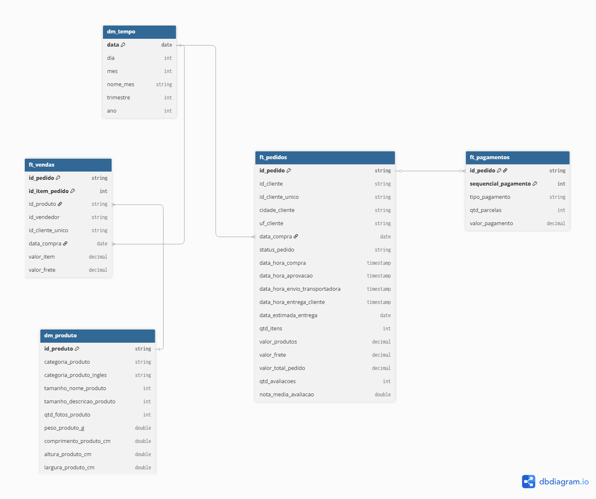

Os relacionamentos definidos no modelo são:

| Tabela de origem | Campo | Cardinalidade | Tabela relacionada | Campo |
|---|---|---|---|---|
| `dm_tempo` | `data` | 1:N | `ft_pedidos` | `data_compra` |
| `dm_tempo` | `data` | 1:N | `ft_vendas` | `data_compra` |
| `dm_produto` | `id_produto` | 1:N | `ft_vendas` | `id_produto` |
| `ft_pedidos` | `id_pedido` | 1:N | `ft_pagamentos` | `id_pedido` |

A relação entre `ft_pedidos` e `ft_pagamentos` representa o fato de que um pedido pode possuir um ou mais registros de pagamento.

Embora `ft_pedidos` e `ft_vendas` compartilhem o identificador `id_pedido`, não foi definido um relacionamento direto entre essas tabelas no modelo. As duas tabelas representam eventos com granularidades distintas e foram mantidas de forma independente, preservando seus respectivos objetivos analíticos.

Da mesma forma, `ft_vendas` e `ft_pagamentos` não são relacionadas diretamente, evitando relacionamentos entre tabelas com múltiplos registros por pedido que poderiam resultar em multiplicação de linhas e duplicação de métricas durante as análises.

## 4. Pipeline de Dados

O pipeline de dados foi estruturado seguindo a arquitetura medalhão, organizando o processamento em três camadas: **Bronze**, **Silver** e **Gold**.

Para facilitar a organização, rastreabilidade e manutenção do processo, as etapas foram separadas em notebooks de acordo com suas responsabilidades:

| Notebook | Etapa | Finalidade |
|---|---|---|
| `01_ingestao_exploracao_bronze` | Bronze | Obtenção dos dados, ingestão das fontes, profiling, catalogação e análises exploratórias |
| `02_silver_qualidade` | Silver | Aplicação das regras de qualidade, tipagem, padronização e persistência dos dados tratados |
| `03_gold_modelagem` | Gold | Integração das fontes tratadas e construção das tabelas fato e dimensão do modelo analítico |

A camada **Bronze** preserva os dados provenientes das fontes com sua estrutura e granularidade originais. A camada **Silver** aplica as regras de qualidade e preparação necessárias para o consumo analítico. Por fim, a camada **Gold** integra os dados tratados e materializa o modelo dimensional definido para responder às perguntas de negócio do projeto.

Os notebooks utilizados na implementação do pipeline estão disponíveis no repositório do projeto:

- [`01_ingestao_exploracao_bronze`](01_ingestao_exploracao_bronze.ipynb)
- [`02_silver_qualidade`](02_silver_qualidade.ipynb)
- [`03_gold_modelagem`](03_gold_modelagem.ipynb)

### 4.1 Persistência das Camadas

As tabelas resultantes de cada etapa do pipeline foram persistidas no Databricks utilizando o formato Delta, organizadas nos schemas `bronze`, `silver` e `gold`.

Na camada Silver foram materializadas as tabelas:

- `silver.orders`
- `silver.order_items`
- `silver.products`
- `silver.customers`
- `silver.order_reviews`
- `silver.order_payments`

Nem todas as tabelas da camada Bronze originaram uma tabela independente na Silver. A tabela `category_translation` foi incorporada ao tratamento de `products`, enquanto os atributos da tabela `sellers` não foram necessários para o modelo analítico definido neste MVP. O identificador do vendedor foi preservado diretamente em `order_items`.

#### Evidência da camada Silver

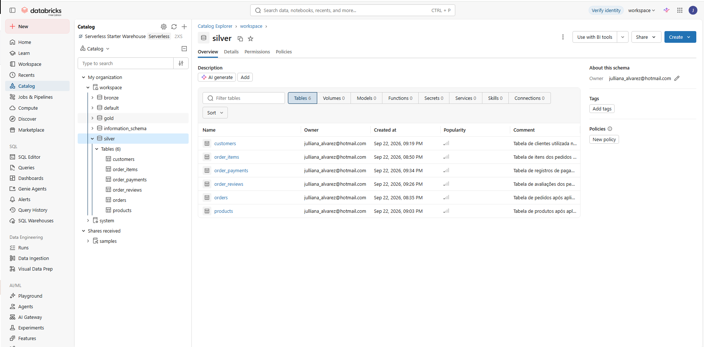


Após os processos de qualidade e preparação realizados na camada Silver, os dados foram transformados e integrados na camada Gold para construção do modelo analítico.

A implementação da camada Gold foi realizada no notebook `03_gold_modelagem`, responsável pela materialização das tabelas fato e dimensão definidas durante a etapa de modelagem.

Foram construídas cinco tabelas analíticas:

- `dm_tempo`: dimensão utilizada para análises temporais;
- `dm_produto`: dimensão contendo os atributos descritivos e físicos dos produtos;
- `ft_pagamentos`: fato na granularidade de um registro por pedido e sequência de pagamento;
- `ft_vendas`: fato na granularidade de um registro por item do pedido;
- `ft_pedidos`: fato na granularidade de um registro por pedido.

As tabelas foram persistidas no schema `workspace.gold` em formato Delta e validadas após sua criação quanto à granularidade, unicidade das chaves, preservação dos registros e consistência dos relacionamentos.

#### Evidência da camada Gold

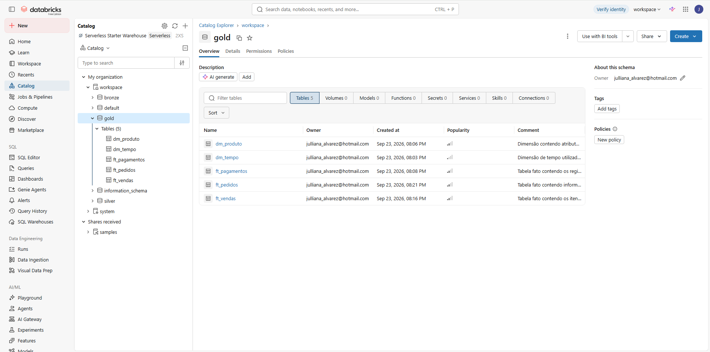

#### Evidência da camada Bronze

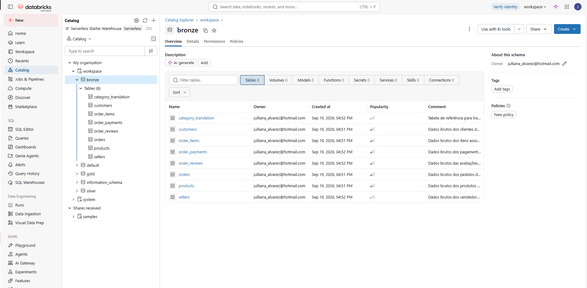

## 5. Qualidade e Transformação dos Dados

A análise de qualidade foi realizada a partir do profiling e das explorações da camada Bronze. Os tratamentos foram aplicados na camada Silver, buscando adequar tipos de dados, tratar inconsistências e padronizar informações sem alterar valores da fonte quando não existiam evidências suficientes para uma correção segura.

Como princípio geral, valores ausentes ou atípicos não foram automaticamente substituídos. Quando não foi possível determinar o valor correto a partir dos dados disponíveis, a informação original foi preservada e a ocorrência documentada.

### 5.1 Tratamentos realizados na camada Silver

| Fonte | Problema ou característica identificada | Tratamento adotado |
|---|---|---|
| `orders` | Campos temporais armazenados como `STRING` | Conversão para `TIMESTAMP` |
| `orders` | Datas de aprovação, envio e entrega ausentes, inclusive poucos casos em pedidos entregues | Valores nulos preservados por não existir informação suficiente para reconstrução das datas |
| `order_items` | `shipping_limit_date` armazenada como `STRING` | Conversão para `TIMESTAMP` |
| `order_items` | Quatro itens com limite de envio em 2020, aproximadamente três anos após a compra | Valores preservados e documentados como atípicos, sem imputação |
| `order_items` | `price` e `freight_value` armazenados como `DOUBLE` | Conversão para `DECIMAL(10,2)` |
| `products` | 610 produtos sem categoria e atributos descritivos | Categoria padronizada como `sem_categoria`; atributos quantitativos ausentes permaneceram nulos |
| `products` | Duas categorias, totalizando 13 produtos, sem tradução | Utilização do nome original da categoria como alternativa à tradução |
| `products` | Grafia `lenght` presente nos nomes de campos da fonte | Padronização para `length` |
| `products` | Campos de tamanho do nome, descrição e quantidade de fotos armazenados como `DOUBLE` | Conversão para `INT` após validação dos valores |
| `customers` | Não foram identificadas inconsistências que demandassem tratamento | Dados preservados sem alteração de conteúdo |
| `order_reviews` | Datas armazenadas como `STRING` | Conversão para `TIMESTAMP` |
| `order_reviews` | Títulos e mensagens opcionais com valores nulos | Nulos preservados por representarem ausência legítima de comentário |
| `order_reviews` | Possibilidade de múltiplas avaliações por pedido | Registros preservados na granularidade original; consolidação realizada posteriormente na Gold |
| `order_payments` | `payment_value` armazenado como `DOUBLE` | Conversão para `DECIMAL(10,2)` |
| `order_payments` | Sequência e quantidade de parcelas armazenadas como `BIGINT` | Conversão para `INT` |
| `order_payments` | 2 registros com zero parcelas, 3 com tipo `not_defined` e 9 com valor zero | Valores preservados por não existir evidência suficiente para determinar valores alternativos |

### 5.2 Transformações realizadas na camada Gold

A camada Gold foi construída a partir das tabelas tratadas na camada Silver, com o objetivo de integrar as diferentes fontes e adequar os dados às granularidades definidas no modelo analítico.

Diferentemente da camada Silver, concentrada principalmente em qualidade, tipagem e padronização, nesta etapa foram realizadas transformações de integração, agregação e derivação de atributos e métricas.

| Tabela Gold | Principais transformações |
|---|---|
| `dm_tempo` | Construção de um calendário entre a menor e a maior data de compra observada nos pedidos. Derivação dos atributos dia, mês, nome do mês, trimestre e ano. |
| `dm_produto` | Seleção dos atributos de produtos previamente tratados na Silver e adequação dos nomes dos campos para a nomenclatura em português adotada no modelo analítico. |
| `ft_pagamentos` | Seleção e renomeação dos campos tratados de pagamentos, preservando a granularidade de pedido + sequência de pagamento. |
| `ft_vendas` | Integração de itens, pedidos e clientes para construção da granularidade de venda por item. Inclusão do identificador único do cliente e da data da compra, além da adequação dos nomes dos campos para o modelo analítico. |
| `ft_pedidos` | Integração de pedidos e clientes com agregações prévias de itens e avaliações. Foram calculadas quantidade de itens, valores de produtos, frete e total do pedido, além da quantidade de avaliações e nota média por pedido. |

Para a construção de `ft_pedidos`, as tabelas de itens e avaliações foram agregadas separadamente antes dos relacionamentos com os pedidos. Essa estratégia evita a multiplicação de registros que poderia ocorrer em um relacionamento direto entre fontes com múltiplas ocorrências para o mesmo pedido.

Pedidos sem itens foram preservados no modelo, recebendo valor `0` para quantidade de itens e métricas monetárias derivadas. Da mesma forma, pedidos sem avaliações receberam `0` em `qtd_avaliacoes`, enquanto `nota_media_avaliacao` permaneceu nula, evitando a atribuição artificial de uma nota inexistente.

Como validação adicional, os valores de produtos e frete registrados em `ft_vendas` foram agregados e comparados com os valores consolidados em `ft_pedidos`. A comparação apresentou ausência de divergências tanto nos valores totais quanto na validação realizada pedido a pedido.

## 6. Análise de Dados

A etapa final do projeto consiste na análise dos dados disponibilizados na camada Gold, com o objetivo de responder às perguntas de negócio definidas no início do MVP.

As análises foram realizadas por meio de consultas SQL no Databricks e visualizações construídas a partir dos resultados obtidos. 
As consultas foram salvas e disponibilizadas no projeto.
- [`04_analise_dados`](04_analise_dados.ipynb)

Para cada pergunta, buscou-se não apenas apresentar as métricas calculadas, mas também interpretar seu significado dentro do contexto do negócio.

Nas análises temporais, foi identificado que os períodos nas extremidades da base apresentam cobertura parcial. Os registros de 2016 estão concentrados principalmente a partir de outubro, enquanto setembro e outubro de 2018 possuem volumes muito inferiores aos meses anteriores. Por esse motivo, quando necessária a avaliação de tendências ao longo do tempo, as interpretações foram concentradas no período entre **janeiro de 2017 e agosto de 2018**.

### 6.1 Evolução do volume e valor dos pedidos

**Pergunta de negócio:** Como evoluíram o volume de pedidos e o valor associado aos pedidos ao longo do período analisado?

Para esta análise, foram considerados os pedidos realizados independentemente de seu status final, uma vez que o objetivo é observar o comportamento da demanda registrada na plataforma.

O **volume de pedidos** corresponde à quantidade de pedidos realizados em cada mês. O **valor dos pedidos** corresponde à soma do valor dos produtos associados aos pedidos, sem considerar o valor do frete.

A distribuição dos pedidos por status também foi analisada como visão complementar, permitindo avaliar se a evolução da demanda foi acompanhada por mudanças na participação de pedidos cancelados.

#### Evolução mensal do volume de pedidos

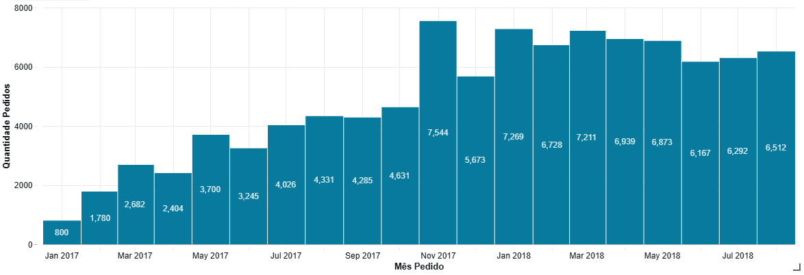

#### Evolução mensal do valor dos pedidos

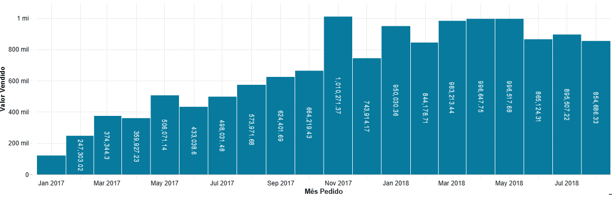

#### Evolução da taxa de cancelamento

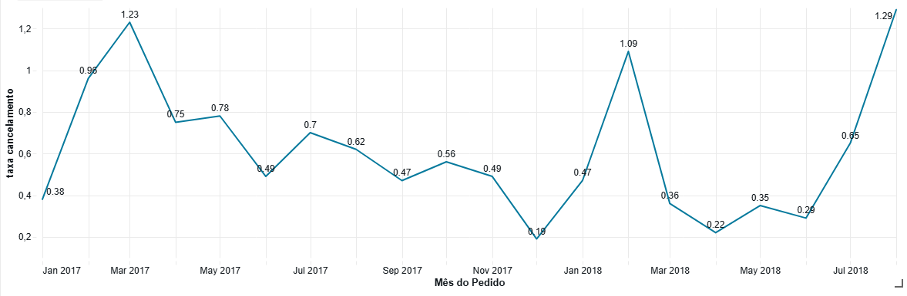

#### Principais insights

A análise evidencia crescimento da demanda ao longo de 2017, com o volume mensal passando de 800 pedidos em janeiro para 4.631 em outubro. Em novembro ocorre um salto expressivo para 7.544 pedidos, maior volume observado no período, acompanhado por valor superior a R$ 1 milhão em produtos associados aos pedidos.

A análise diária de novembro mostra uma forte concentração de pedidos em **24/11/2017**, data da Black Friday daquele ano. Nesse dia foram registrados **1.176 pedidos e aproximadamente R$ 152,7 mil em produtos**, os maiores valores diários do mês. O comportamento observado é consistente com um possível efeito da Black Friday sobre a demanda, embora a base não permita identificar diretamente se os pedidos foram originados pela campanha.

Após o pico de novembro e a redução observada em dezembro, o volume retorna a um patamar elevado em 2018. Entre janeiro e agosto, foram registrados aproximadamente 6,2 mil a 7,3 mil pedidos por mês, indicando maior estabilidade em relação ao crescimento observado durante grande parte de 2017.

A taxa de cancelamento permaneceu baixa durante o período comparável, mas apresentou oscilações pontuais. Destacam-se março de 2017 (**1,23%**), fevereiro de 2018 (**1,09%**) e agosto de 2018, que apresentou a maior taxa do período analisado, de **1,29%**.

Apesar desses episódios, não foi observada uma trajetória contínua de crescimento da taxa de cancelamento. Os resultados indicam, portanto, expansão da demanda durante 2017 e manutenção de um patamar elevado em 2018, com evidência de sazonalidade relevante no período da Black Friday e taxas de cancelamento geralmente baixas, embora com picos específicos que podem justificar investigações adicionais.

### 6.2 Desempenho das categorias de produtos

**Pergunta de negócio:** Quais categorias de produtos possuem maior participação no valor vendido e no volume de vendas, e como se diferenciam em relação ao valor médio por item?

Para esta análise, foram considerados apenas os itens pertencentes a **pedidos entregues (`delivered`)**, de forma que as métricas representem vendas efetivamente concluídas.

O **volume de vendas** corresponde à quantidade de itens vendidos em cada categoria, enquanto o **valor vendido** corresponde à soma do valor dos produtos, desconsiderando o frete. Como métrica complementar, foi analisado o **valor médio por item**, permitindo identificar diferenças no perfil de preço entre as categorias.

Para facilitar a visualização da distribuição do valor vendido entre o grande número de categorias existentes na base, as 30 categorias de maior valor vendido foram apresentadas individualmente e as demais foram agrupadas como **Outros**.

#### Valor vendido por categoria

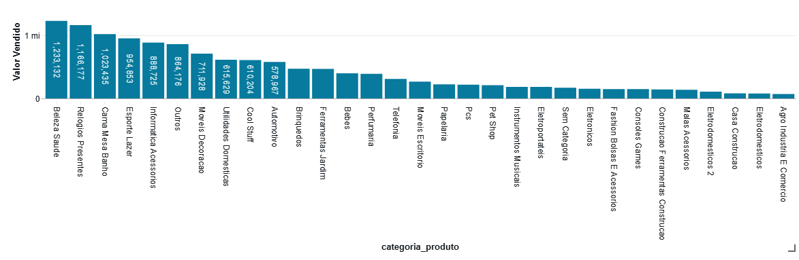

A análise do valor vendido mostra que **Beleza e Saúde** apresenta a maior participação financeira entre as categorias, representando **9,33% do valor vendido**, seguida por **Relógios e Presentes (8,82%)** e **Cama, Mesa e Banho (7,74%)**.

#### Participação no volume e no valor vendido

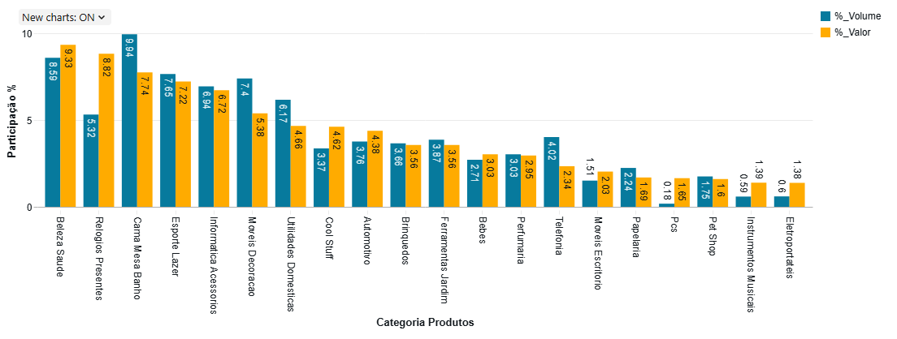

A comparação entre participação no volume e no valor mostra que a relevância de uma categoria não está necessariamente associada apenas à quantidade de itens comercializados.

**Beleza e Saúde** apresenta participação elevada nas duas perspectivas, correspondendo a **8,59% do volume de itens e 9,33% do valor vendido**.

**Relógios e Presentes**, por outro lado, representa **5,32% do volume**, mas responde por **8,82% do valor vendido**, demonstrando uma participação financeira proporcionalmente superior ao seu peso em quantidade.

O comportamento inverso pode ser observado em **Cama, Mesa e Banho**, categoria com a maior participação em volume (**9,94%**), mas responsável por **7,74% do valor vendido**. **Telefonia** também apresenta essa característica, correspondendo a **4,02% do volume e 2,34% do valor vendido**.

#### Valor médio por item

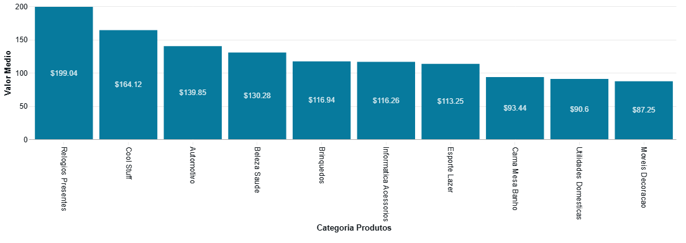

A análise do valor médio ajuda a explicar parte das diferenças observadas entre participação em volume e participação financeira.

Entre as dez categorias de maior valor vendido, **Relógios e Presentes** apresenta o maior valor médio por item, de **R$ 199,04**, contribuindo para que sua participação no valor vendido seja proporcionalmente superior à sua participação em volume.

**Cool Stuff** também apresenta valor médio elevado, de **R$ 164,12**, enquanto **Cama, Mesa e Banho** apresenta média de **R$ 93,44** por item. Já **Móveis e Decoração**, apesar de estar entre as categorias de maior valor vendido, apresenta valor médio de **R$ 87,25**, evidenciando maior dependência do volume comercializado para composição de seu resultado.

#### Principais insights

Os resultados evidenciam diferentes perfis de desempenho entre as categorias. Algumas apresentam relevância simultânea em volume e valor, como **Beleza e Saúde**, enquanto outras alcançam elevada participação financeira mesmo com menor participação em quantidade, como **Relógios e Presentes**.
Por outro lado, categorias como **Cama, Mesa e Banho** apresentam maior peso em volume do que em valor vendido, indicando que seu desempenho comercial está mais associado à quantidade de itens comercializados.

A análise conjunta das três métricas demonstra, portanto, que **volume de vendas, participação financeira e valor médio por item oferecem perspectivas complementares sobre o desempenho das categorias**. Avaliar apenas o valor vendido ou apenas a quantidade de itens poderia ocultar diferenças importantes no perfil comercial dos produtos.

### 6.3 Distribuição geográfica e recompra dos clientes

**Pergunta de negócio:** Como os clientes estão distribuídos geograficamente e qual é o comportamento de recompra?

Para esta análise, foram considerados apenas os pedidos entregues (`delivered`), de forma que a distribuição geográfica e o comportamento de recompra representem relações de compra efetivamente concluídas.

A localização dos clientes foi analisada a partir do estado associado aos pedidos. Para identificar recompras, foi utilizado o `id_cliente_unico`, que permite reconhecer um mesmo consumidor em diferentes pedidos.

#### Distribuição geográfica dos clientes

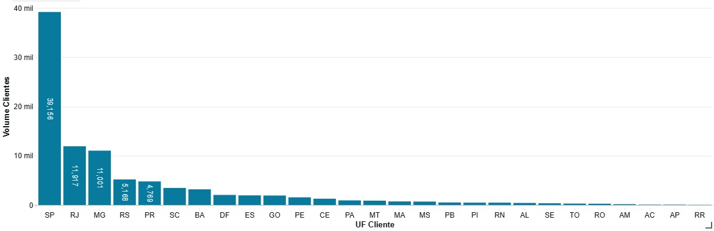

A distribuição geográfica apresenta forte concentração no estado de **São Paulo**, que representa **41,92% dos clientes** com pedidos entregues. Na sequência aparecem **Rio de Janeiro (12,76%)** e **Minas Gerais (11,78%)**.

Juntos, os três estados concentram **66,46% dos clientes**, evidenciando uma presença expressiva da região Sudeste na base analisada.

#### Comportamento de recompra

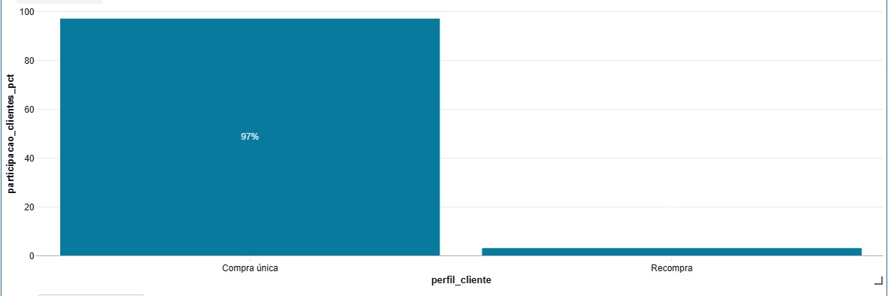

A análise de recorrência mostra que **97,00% dos clientes realizaram apenas uma compra entregue** durante o período disponível na base, enquanto **3,00% realizaram dois ou mais pedidos**.

Entre os clientes recorrentes, a maior parte realizou somente uma segunda compra: **2,76% do total de clientes possuem exatamente dois pedidos**, enquanto apenas **0,24% realizaram três ou mais pedidos**.

#### Principais insights

Os resultados evidenciam uma **forte concentração geográfica dos clientes**, principalmente em São Paulo e, de forma mais ampla, nos três principais estados do Sudeste analisados.

Ao mesmo tempo, a recorrência observada é baixa: apenas **3% dos clientes apresentam mais de uma compra entregue** no período disponível. A combinação desses resultados mostra uma base caracterizada por alta concentração geográfica e predominância de consumidores com compra única.

A taxa de recompra deve ser interpretada considerando a janela temporal disponível no dataset. Os dados permitem identificar a recorrência observada durante o período analisado, mas não permitem concluir sobre compras realizadas pelos mesmos consumidores antes ou depois da cobertura da base.

### 6.4 Meios de pagamento e parcelamento

**Pergunta de negócio:** Quais são as principais formas de pagamento utilizadas e como se distribuem o parcelamento e o uso de múltiplos meios de pagamento?

Para esta análise, foram considerados os pagamentos associados a pedidos entregues (`delivered`). Como um mesmo pedido pode possuir mais de um registro e utilizar diferentes formas de pagamento, foram analisados tanto a participação dos meios nos pedidos quanto sua participação no valor total pago.

#### Principais meios de pagamento

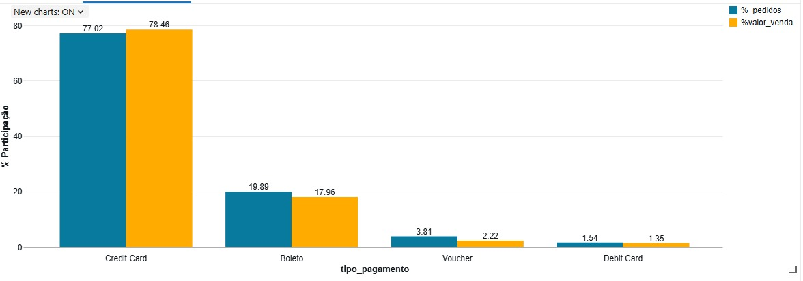

O **cartão de crédito** é o principal meio de pagamento da base, estando presente em **77,02% dos pedidos** e concentrando **78,46% do valor pago**. O **boleto** aparece em segundo lugar, presente em **19,89% dos pedidos** e responsável por **17,96% do valor**.

Voucher e cartão de débito apresentam participações significativamente menores. Como um mesmo pedido pode utilizar mais de um meio, a soma da participação dos meios nos pedidos pode ultrapassar 100%.

#### Distribuição do parcelamento no cartão de crédito

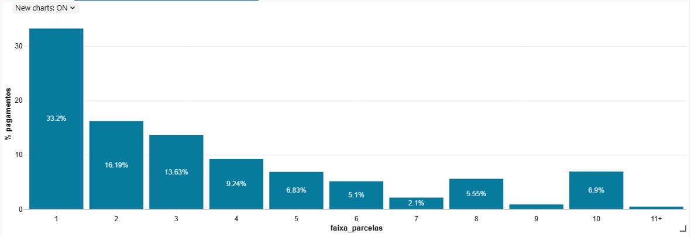

Entre os pagamentos realizados com cartão de crédito, o pagamento em **uma parcela é a modalidade individual mais frequente, representando 33,20%**. Entretanto, considerando conjuntamente todas as demais faixas, aproximadamente **66,8% dos pagamentos foram parcelados em duas ou mais vezes**.

As modalidades de duas e três parcelas representam, respectivamente, **16,19% e 13,63%** dos pagamentos com cartão, mostrando que o parcelamento está presente em parcela relevante das transações.

#### Valor médio e número de parcelas

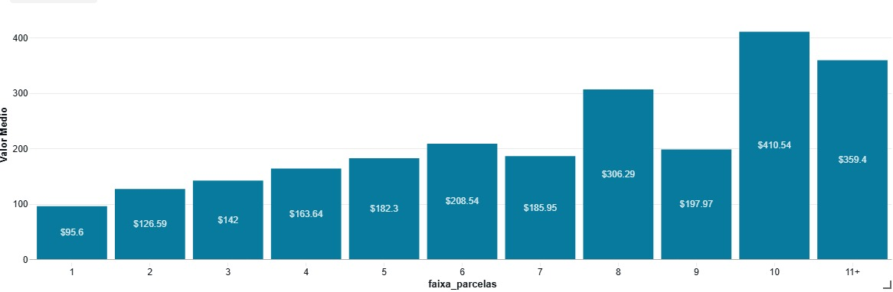

Além da frequência, observa-se uma tendência de valores médios mais elevados nas faixas de maior parcelamento. O valor médio passa de **R$ 95,60 nos pagamentos em uma parcela** para R$ 126,59 em duas, R$ 142,00 em três e R$ 208,54 em seis parcelas, chegando a **R$ 410,54 nos pagamentos em dez parcelas**.

A relação não é estritamente crescente em todas as faixas, mas o comportamento observado sugere maior utilização de parcelamentos mais longos em pagamentos de maior valor.

#### Utilização de múltiplos meios de pagamento

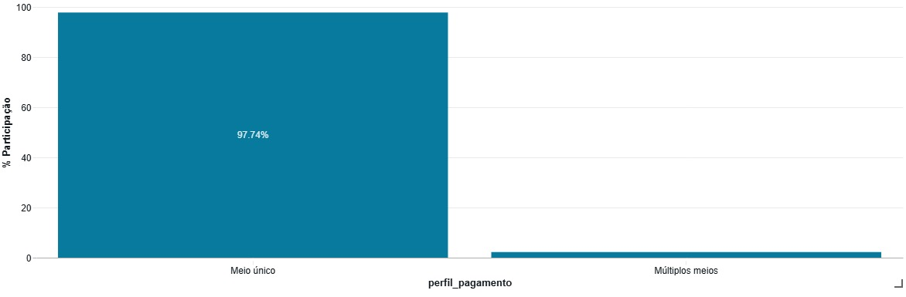

A combinação de diferentes meios de pagamento em um mesmo pedido é pouco frequente. **97,74% dos pedidos utilizaram apenas um meio de pagamento**, enquanto **2,26% utilizaram dois ou mais meios distintos**.

#### Principais insights

Os resultados mostram uma forte predominância do **cartão de crédito**, tanto em utilização quanto em participação no valor pago. Além disso, embora o pagamento em uma única parcela seja a modalidade individual mais comum, o parcelamento representa a maior parte dos pagamentos realizados com cartão.

A análise do valor médio sugere ainda uma associação entre compras de maior valor e faixas mais elevadas de parcelamento, embora esse comportamento não seja uniforme em todas as quantidades de parcelas.

Por fim, a utilização de múltiplos meios em uma mesma compra apresenta baixa representatividade, indicando que a grande maioria dos pedidos é concluída utilizando uma única forma de pagamento.

### 6.5 Prazo de entrega e avaliação dos clientes

**Pergunta de negócio:** Pedidos entregues após a data estimada apresentam avaliações diferentes daqueles entregues no prazo ou antecipadamente?

Para esta análise, foram considerados apenas pedidos com status `delivered` e com informações disponíveis sobre a data efetiva e a data estimada de entrega.

Os pedidos foram classificados em dois grupos:

- **No prazo ou antecipado:** pedidos entregues na data estimada ou antes dela;
- **Atrasado:** pedidos entregues após a data estimada.

A experiência do cliente foi analisada por meio da nota média de avaliação consolidada por pedido. Pedidos sem avaliação não foram considerados no cálculo das notas médias.

#### Nota média por cumprimento do prazo

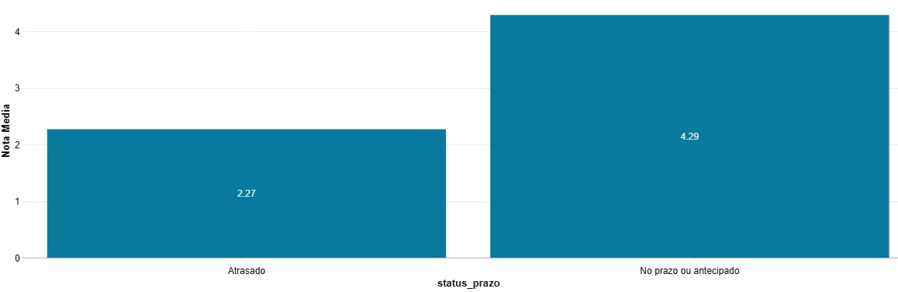

A maior parte dos pedidos foi entregue dentro da estimativa: **93,23% das entregas ocorreram no prazo ou antecipadamente**, enquanto **6,77% foram realizadas após a data estimada**.

Apesar da baixa participação dos atrasos no total de entregas, observa-se uma diferença expressiva na avaliação dos dois grupos. Pedidos entregues no prazo ou antecipadamente apresentam **nota média de 4,29**, enquanto pedidos atrasados apresentam média de apenas **2,27**, uma diferença de **2,02 pontos** na escala de avaliação de 1 a 5.

#### Distribuição das avaliações por cumprimento do prazo

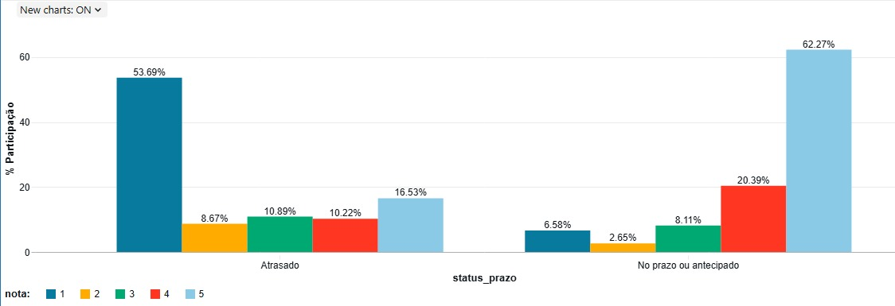

A distribuição das notas evidencia que a diferença entre os grupos não se limita à média das avaliações.

Entre os pedidos atrasados, **53,69% receberam nota 1**, enquanto apenas **16,53% receberam nota 5**. Considerando conjuntamente as notas 1 e 2, **62,36% das avaliações de pedidos atrasados estão concentradas nas duas menores notas**.

Entre os pedidos entregues no prazo ou antecipadamente, o comportamento é praticamente inverso: **62,27% receberam nota 5**, enquanto apenas **6,58% receberam nota 1**. As notas 1 e 2 representam conjuntamente apenas **9,23% das avaliações desse grupo**.

#### Principais insights

Os resultados mostram uma associação relevante entre o cumprimento da estimativa de entrega e a avaliação dos clientes. Embora os atrasos representem apenas **6,77% dos pedidos entregues analisados**, sua ocorrência está associada a avaliações significativamente inferiores.

A diferença aparece tanto na nota média — **4,29 para entregas no prazo ou antecipadas contra 2,27 para entregas atrasadas** — quanto na distribuição das avaliações. Enquanto pedidos dentro da estimativa apresentam forte concentração de notas máximas, os pedidos atrasados apresentam concentração expressiva de notas mínimas.

Dessa forma, os dados indicam que o **cumprimento do prazo estimado de entrega está fortemente associado a uma melhor experiência de avaliação**, enquanto atrasos estão associados a uma maior incidência de avaliações negativas.

A análise demonstra uma associação entre prazo de entrega e avaliação, mas não permite afirmar que o atraso seja, isoladamente, a causa das notas mais baixas, uma vez que outros aspectos da experiência do pedido também podem influenciar a avaliação do cliente.

### 6.6 Discussão geral dos resultados

A pergunta central deste projeto buscou compreender **como os aspectos comerciais, geográficos e operacionais caracterizam os pedidos realizados no ecossistema Olist e de que forma o desempenho logístico se relaciona com a experiência dos clientes**.

A análise integrada dos dados permite caracterizar um ecossistema que apresentou expansão da demanda ao longo do período analisado, com um portfólio diversificado e diferentes perfis de desempenho entre as categorias. O resultado comercial não está associado apenas ao volume de itens vendidos: algumas categorias ganham relevância pela quantidade comercializada, enquanto outras se destacam pelo maior valor médio dos produtos.

Do ponto de vista dos clientes, observa-se uma base geograficamente concentrada, principalmente nos estados do Sudeste, e marcada pela predominância de compras únicas dentro da janela temporal disponível. Esse comportamento indica que o volume observado no período está associado principalmente a uma ampla quantidade de consumidores com baixa recorrência, e não a um grupo expressivo de clientes realizando compras repetidas.

O comportamento de pagamento complementa esse perfil ao demonstrar forte utilização do cartão de crédito e relevância do parcelamento. A presença de pagamentos parcelados, especialmente em transações de maior valor, evidencia a importância dessa modalidade como parte da dinâmica comercial observada no ecossistema.

Na dimensão operacional, a maior parte dos pedidos foi entregue dentro da estimativa informada ao cliente. Entretanto, quando ocorre atraso, observa-se uma mudança expressiva no padrão das avaliações: entregas atrasadas estão associadas a notas médias inferiores e a uma concentração significativamente maior de avaliações negativas. Dessa forma, mesmo representando uma parcela minoritária dos pedidos, os atrasos se mostram relevantes para a experiência percebida pelo cliente.

Em conjunto, os resultados desenham um cenário de **crescimento comercial sustentado por uma base ampla, porém pouco recorrente e geograficamente concentrada, com forte presença do crédito e do parcelamento e no qual o cumprimento da expectativa de entrega se destaca como um aspecto operacional fortemente associado à satisfação do cliente**.

Assim, a análise demonstra que compreender o desempenho do e-commerce exige observar conjuntamente as diferentes etapas da jornada de compra. Características da demanda, do mix de produtos, dos clientes e das formas de pagamento ajudam a explicar como as vendas se estruturam, enquanto o desempenho da entrega evidencia como a execução operacional se relaciona com a experiência registrada após a compra.

As conclusões são descritivas e estão limitadas à cobertura temporal e às informações disponíveis no dataset. As associações identificadas, especialmente entre atraso e avaliação, não devem ser interpretadas isoladamente como relações causais.


## 7. Autoavaliação

Ao início deste projeto, o objetivo definido foi construir um pipeline de dados ponta a ponta na nuvem que permitisse organizar e transformar os dados públicos de e-commerce da Olist em informações adequadas para análise, buscando compreender como aspectos comerciais, geográficos e operacionais caracterizam os pedidos realizados no ecossistema e como o desempenho logístico se relaciona com a experiência dos clientes.

Considero que os objetivos propostos foram atingidos. A partir dos dados brutos, foi possível construir um pipeline estruturado nas camadas Bronze, Silver e Gold, contemplando ingestão, persistência, tratamento de qualidade, modelagem, catalogação e disponibilização dos dados para análise. O modelo final permitiu responder às perguntas de negócio definidas no início do projeto e construir uma visão integrada sobre vendas, produtos, clientes, pagamentos e experiência de entrega.

Uma das principais dificuldades encontradas durante o desenvolvimento foi compreender corretamente a granularidade e os relacionamentos entre as diferentes fontes. Um mesmo pedido pode possuir múltiplos itens, pagamentos e avaliações, o que exigiu atenção durante a modelagem para evitar multiplicação de registros e distorção das métricas. A identificação da diferença entre `customer_id` e `customer_unique_id` também foi importante para que a análise de recorrência dos clientes representasse corretamente o comportamento disponível na base.

Durante essa etapa, também foi identificado que alguns pedidos possuíam mais de uma avaliação associada. Como a tabela analítica de pedidos deveria manter a granularidade de um registro por pedido, foi necessário definir uma regra para consolidação dessas avaliações. Optou-se pela utilização da **nota média das avaliações por pedido**, preservando também a quantidade de avaliações associadas. A decisão foi considerada adequada ao escopo do MVP após a análise exploratória demonstrar que os pedidos com múltiplas avaliações representavam uma parcela pequena da base, reduzindo o impacto dessa consolidação sobre o comportamento geral das avaliações.

Outro desafio foi definir quais tratamentos deveriam ser realizados na camada Silver sem alterar informações válidas da fonte. A presença de valores nulos, categorias sem tradução e situações atípicas exigiu uma análise do significado de cada campo antes da definição das regras de qualidade, evitando tratamentos automáticos que pudessem modificar o comportamento original dos dados.

A etapa analítica também trouxe o desafio de transformar perguntas de negócio em métricas coerentes com a granularidade do modelo. Ao longo das análises, foi necessário definir critérios como considerar apenas pedidos entregues em determinadas perguntas, diferenciar participação em volume e em valor e interpretar associações sem assumir relações causais que os dados não permitem comprovar.

Como trabalhos futuros, o pipeline poderia ser evoluído com mecanismos de **orquestração e execução automatizada**, além da implementação de **testes automatizados de qualidade e integridade dos dados** entre as camadas. O escopo analítico também poderia ser ampliado com análises geográficas mais detalhadas, utilização dos dados dos vendedores e aprofundamento do comportamento de recompra e da relação entre logística e avaliação dos clientes.

Essas evoluções permitiriam transformar o MVP em uma solução mais próxima de um pipeline produtivo e, ao mesmo tempo, ampliar seu potencial como projeto de portfólio, demonstrando não apenas a construção da arquitetura de dados, mas também sua manutenção, monitoramento e utilização para geração contínua de informações de negócio.
